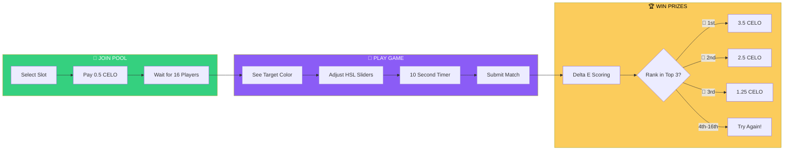
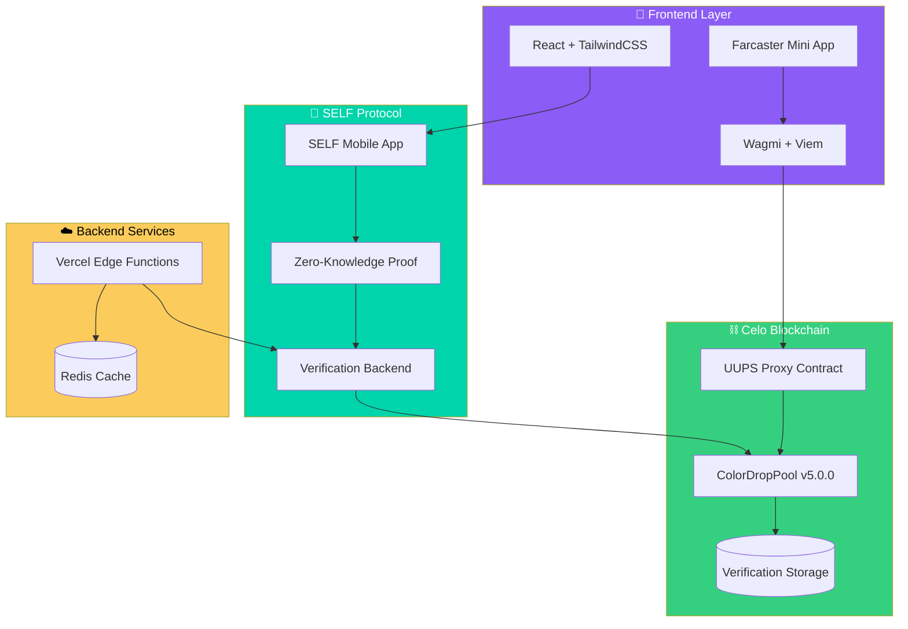
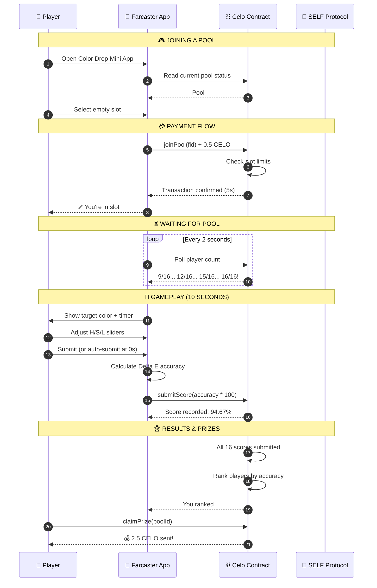
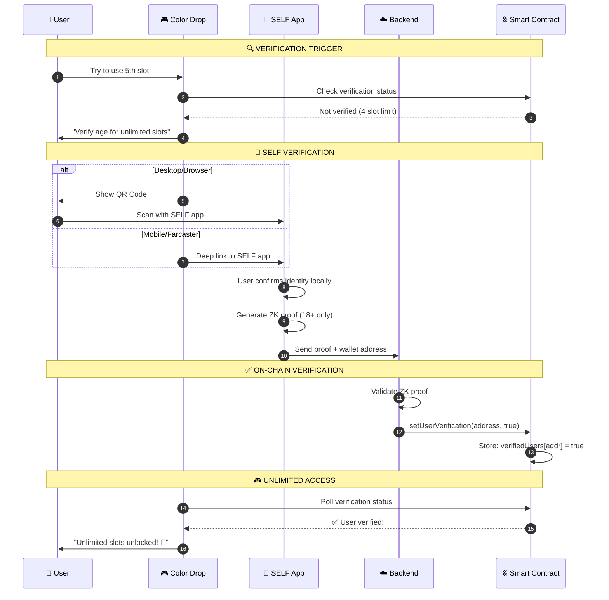
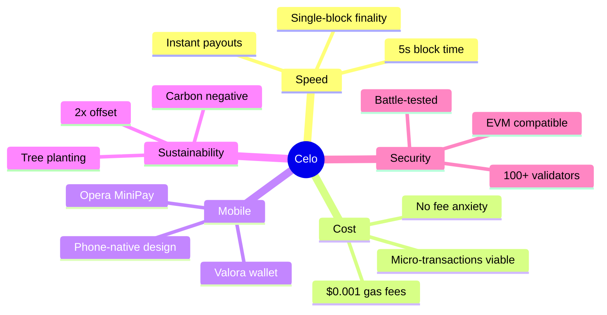
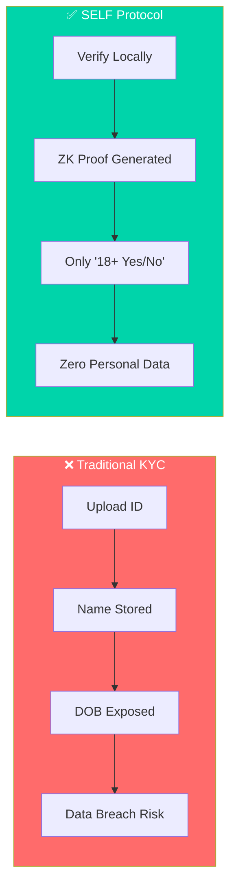
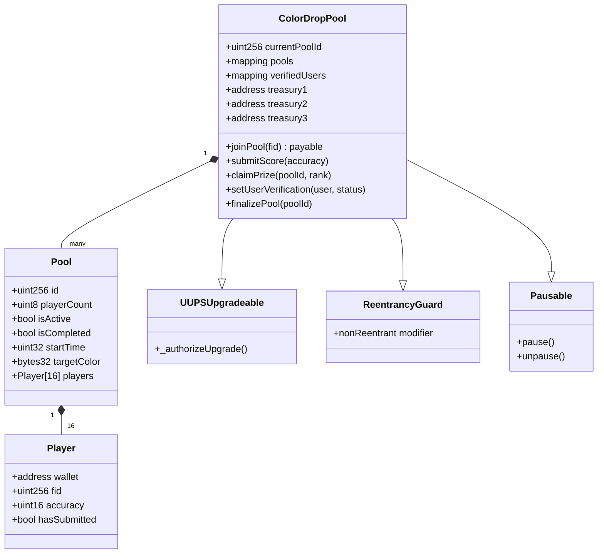
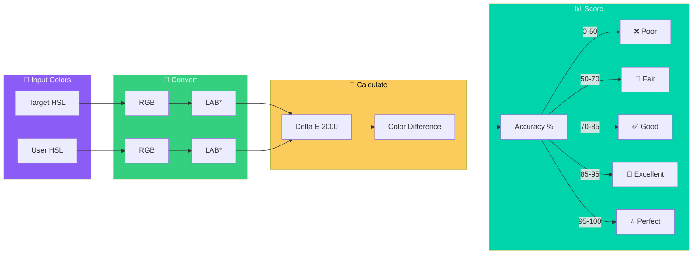
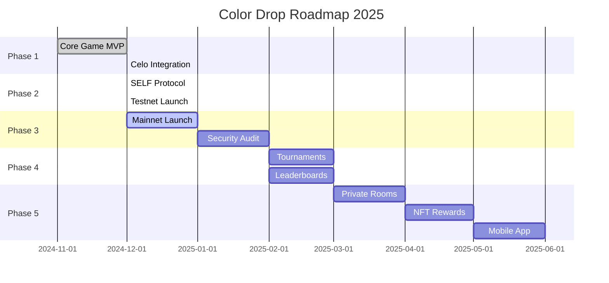

# 🎨 Color Drop Tournament

<div align="center">


### **The Ultimate Color Matching Challenge on Web3**

*Match colors. Win CELO. Prove your perception.*

[](https://celo.org)
[](https://farcaster.xyz)
[](https://self.xyz)

[**🎮 Play Now**](https://colordrop.art3hub.xyz) · [**📖 Game Rules**](./GAME-RULES.md) · [**🔗 View Contract**](https://celo.blockscout.com/address/0x05342b1bA42A5B35807592912d7f073DfB95873a)

</div>

---

## ⚡ What is Color Drop?

Color Drop Tournament is a **skill-based micro-gaming experience** where 16 players compete in real-time to match a target color with surgical precision. Built as a **Farcaster Mini App** on **Celo blockchain**, it combines the addictive simplicity of casual gaming with the transparency and instant payouts of Web3.

```
🎯 Match the color → 🏆 Beat 15 opponents → 💰 Win up to 3.5 CELO
```

**No luck. No randomness. Pure skill.**

---

## 🏆 Why Players Love It

| Feature | What It Means For You |
|---------|----------------------|
| **10-Second Rounds** | Quick dopamine hits, perfect for mobile |
| **Skill-Based Wins** | Your color perception = Your advantage |
| **Instant Payouts** | Win? CELO hits your wallet in 5 seconds |
| **Micro Stakes** | Just $0.05 per game — anyone can play |
| **Privacy First** | SELF Protocol: Verify age without exposing identity |
| **Carbon Negative** | Every game plants trees (Celo's commitment) |

---

## 🎮 How It Works



### The Game Loop

1. **Join a Pool** — Pick any empty slot in the 4×4 grid, pay 0.5 CELO
2. **Wait for Players** — Pool starts when all 16 slots are filled
3. **Match the Color** — You have exactly 10 seconds to match the target using Hue, Saturation, and Lightness sliders
4. **Score Calculated** — Delta E 2000 algorithm measures your accuracy (used by professional colorists!)
5. **Winners Announced** — Top 3 players claim prizes directly from the smart contract

---

## 🏗️ System Architecture



---

## 🎯 Complete Player Journey



---

## 🔐 Age Verification Flow (SELF Protocol)



---

## 💚 Why We Built on Celo

### The Perfect Blockchain for Gaming



### Celo vs Other Chains

| Requirement | Celo | Ethereum | Polygon | Arbitrum |
|-------------|------|----------|---------|----------|
| **Block Time** | 5 seconds | 12 seconds | 2 seconds | 0.25 seconds |
| **Finality** | ✅ 1 block | ❌ 6+ blocks | ⚠️ Variable | ⚠️ L1 dependent |
| **Gas Cost** | **$0.001** | $5-50+ | $0.01-0.10 | $0.01-0.50 |
| **Mobile SDK** | ✅ Native | ❌ None | ❌ None | ❌ None |
| **Carbon Status** | ✅ **Negative** | ⚠️ Neutral | ⚠️ Neutral | ⚠️ Neutral |

### Why This Matters for Color Drop

```
💰 Economics That Work:

On Ethereum:
  Entry fee: $0.05
  Gas cost:  $5.00
  Total:     $5.05 (100x overhead!)

On Celo:
  Entry fee: $0.05
  Gas cost:  $0.001
  Total:     $0.051 (2% overhead)

→ Celo makes micro-gaming possible.
```

---

## 🛡️ Why SELF Protocol for Age Verification

### Privacy-Preserving Compliance



### What Gets Stored

| Data Point | Traditional KYC | SELF Protocol |
|------------|-----------------|---------------|
| Full Name | ✅ Stored | ❌ Never shared |
| Date of Birth | ✅ Stored | ❌ Never shared |
| ID Document | ✅ Uploaded | ❌ Stays on device |
| Home Address | ✅ Stored | ❌ Never shared |
| **Age Verified (18+)** | ✅ Yes | ✅ **Yes (only this!)** |

### Unlock Full Game Potential

| Feature | Unverified | SELF Verified |
|---------|------------|---------------|
| Slots per pool | Max 4 | **Unlimited** |
| Pool coverage | 44% max | 100% possible |
| Strategic depth | Limited | Full multi-slot tactics |
| Competitive edge | Basic | Maximum |

---

## 📊 Smart Contract Architecture



### Contract Details

| Property | Value |
|----------|-------|
| **Mainnet Proxy** | [`0x05342b1bA42A5B35807592912d7f073DfB95873a`](https://celo.blockscout.com/address/0x05342b1bA42A5B35807592912d7f073DfB95873a) |
| **Version** | v5.0.0 |
| **Network** | Celo Mainnet (Chain ID: 42220) |
| **Entry Fee** | 0.5 CELO |
| **Pool Size** | 16 players |
| **Treasuries** | 3 (fee split equally) |
| **Upgradeable** | UUPS Pattern |

### Prize Distribution

```
Total Pool: 8 CELO (16 × 0.5 CELO)

🥇 1st Place:  3.5 CELO   (43.75%)
🥈 2nd Place:  2.5 CELO   (31.25%)
🥉 3rd Place:  1.25 CELO  (15.625%)
💼 Platform:   0.75 CELO  (9.375% - split 3 ways)
```

---

## 🎨 Color Scoring Algorithm

We use **Delta E 2000 (CIEDE2000)** — the same algorithm used by professional colorists and industrial color matching systems.



### Accuracy Ratings

| Score | Rating | Description |
|-------|--------|-------------|
| 95-100% | ⭐ **Perfect** | Nearly indistinguishable |
| 85-94% | 🎯 **Excellent** | Very close match |
| 70-84% | ✅ **Good** | Noticeable but acceptable |
| 50-69% | 🔶 **Fair** | Visible difference |
| 0-49% | ❌ **Poor** | Significant mismatch |

---

## 🚀 Quick Start

### For Players

1. **Open Farcaster** and search for Color Drop
2. **Connect wallet** (auto-connects in Mini App)
3. **Join a pool** (0.5 CELO entry)
4. **Match colors** when pool is full
5. **Claim prizes** if you're in top 3!

### For Developers

```bash
# Clone the repository
git clone https://github.com/art3hub/colordrop.git
cd colordrop

# Install frontend
cd ColorDropApp
npm install
npm run dev

# Deploy contracts (optional)
cd ../Contracts
npm install
npm run deploy:sepolia
```

---

## 📁 Project Structure

```
ColorDrop/
├── ColorDropApp/           # Next.js 16 Frontend
│   ├── app/               # App Router pages
│   │   ├── api/          # Edge API routes
│   │   └── .well-known/  # Farcaster manifest
│   ├── components/        # React components
│   ├── hooks/            # Custom React hooks
│   ├── contexts/         # React contexts
│   └── lib/              # Utilities
│
├── Contracts/             # Solidity Smart Contracts
│   ├── contracts/        # ColorDropPool.sol
│   ├── scripts/          # Deploy & upgrade scripts
│   └── test/             # Contract tests
│
├── CLAUDE.md             # AI development guide
├── GAME-RULES.md         # Complete game rules
└── README.md             # This file
```

---

## 🎯 Roadmap



### Upcoming Features

- [ ] **Daily Challenges** — Special color palettes with boosted prizes
- [ ] **Streak Bonuses** — Win consecutive games for multipliers
- [ ] **Private Rooms** — Invite friends to compete
- [ ] **NFT Trophies** — Collectible achievements for top players
- [ ] **Leaderboards** — Season rankings with exclusive rewards

---

## 🔐 Security

| Protection | Implementation |
|------------|----------------|
| Reentrancy | `ReentrancyGuard` on all payable functions |
| Pausable | Emergency stop capability |
| Access Control | Role-based (Admin, Upgrader, Verifier) |
| Upgradeable | UUPS pattern for safe upgrades |
| Age Verification | SELF Protocol zero-knowledge proofs |

**Report vulnerabilities:** security@art3hub.xyz

---

## 🌐 Links

| Resource | Link |
|----------|------|
| **Play Now** | [colordrop.art3hub.xyz](https://colordrop.art3hub.xyz) |
| **Smart Contract** | [Celo Blockscout](https://celo.blockscout.com/address/0x05342b1bA42A5B35807592912d7f073DfB95873a) |
| **Farcaster** | /color-drop channel |
| **GitHub** | [Art3Hub/ColorDrop](https://github.com/art3hub/colordrop) |

---

## 👥 Built By

<div align="center">

**[Art3Hub](https://art3hub.xyz)** — Building the future of Web3 gaming

*With love for the Farcaster × Celo ecosystem*

</div>

---

## 🙏 Acknowledgments

- **Farcaster** — For the Mini App SDK and social layer
- **Celo Foundation** — For mobile-first, carbon-negative blockchain
- **SELF Protocol** — For privacy-preserving identity verification
- **OpenZeppelin** — For battle-tested smart contract libraries

---

<div align="center">

**Ready to prove your color perception? 🎨**

[**🎮 Play Color Drop Now**](https://colordrop.art3hub.xyz)

*Match colors. Win CELO. Be the best.*

</div>
